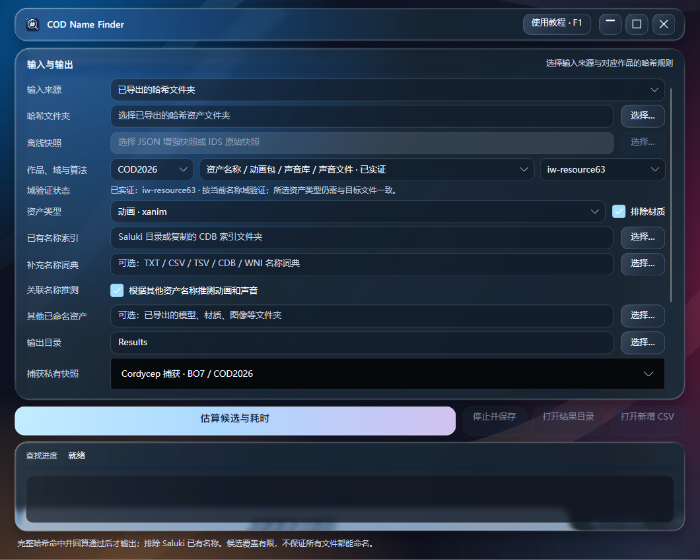

# COD Name Finder

版本 2.2.2。Windows 11 x64 资产名称计算工具：从导出的哈希文件夹或离线资产快照读取目标，用可信名称、作品模板和关联资产线索生成候选，完整键命中并独立回算后输出 Saluki CDB 与新增名称 CSV。模型可提供已经解析的名称线索，未知模型不作为目标。

下载 Windows 安装包：[CODNameFinder-2.2.2-Setup.exe](https://github.com/ez4cywa/cod-name-finder/releases/download/v2.2.2/CODNameFinder-2.2.2-Setup.exe)。[发布页与校验文件](https://github.com/ez4cywa/cod-name-finder/releases/tag/v2.2.2)提供对应版本的源码和 SHA256，验证范围见[2.2.2 发布说明](docs/release-2.2.2.zh-CN.md)。随包教程可在界面点击“使用教程 · F1”打开，也可在线阅读[完整使用教程](docs/user-guide.zh-CN.md)。

界面采用 Avalonia、液态玻璃风格与 .NET NativeAOT；文件处理继续由随包提供的 Python 后端完成，Rust CPU 和 OpenCL GPU 负责匹配。新电脑使用文件夹或完整快照计算时，无需另装 Python、.NET、Rust、Git、Ghidra、游戏或 Cordycep。捕获新快照的电脑使用用户自己安装的兼容加载器和游戏文件。名称计算默认在本地运行，社区同步须由用户显式启用。



## 拿到工具先做什么

1. 退出旧版，运行 `CODNameFinder-2.2.2-Setup.exe`，从开始菜单启动；保留完整安装目录。
2. 将实际 Saluki 的 `hash_pkg` 复制到本机独立数据目录。新电脑无需运行 Saluki，示例索引只能测试流程。
3. 点击“使用教程 · F1”，先用 `examples/one-click` 的占位动画跑通一次。
4. 选择“已导出的哈希文件夹”或“离线资产快照 · JSON / IDS”，填入目标目录或完整捕获目录中的 `snapshot.json`。选择作品、名称域、规则、资产类型、已有CDB索引与独立输出目录。动画或声音可保留关联名称推测。
5. 点击“估算候选与耗时”，检查候选规模、碰撞期望、CPU 时间区间及按类型的 Saluki 差集；再点击“确认计算并导出”。更改配置后会重新估算。
6. 用“打开新增 CSV”查看结果。向 Saluki 安装名称时先备份，再使用 `saluki-ready/hash_pkg` 中保留旧条目的合并文件。

完整离线教程在 [docs/user-guide.zh-CN.md](docs/user-guide.zh-CN.md)，主窗口和教程均支持 F1。小窗口可滚动输入区域，计算、停止和结果操作保留在下方。

## 2.2.2 的本地 Cordycep 与 BAT 启动

界面提供“读取已加载实例”和“运行所选 BAT 并捕获”。选择 Cordycep 目录后，启动脚本下拉列出目录根的 `.bat`；“刷新 BAT”保留当前选择，切换目录或作品时优先选择 `RunMW7Beta.bat` / `RunBO7.bat`。脚本名可包含中文和空格，偏好随目录保存，运行时不能修改。

本版独立登记本地两个 Cordycep CLI 构建：虽然文件版本均为 **2.9.0.0**，旧 SHA256 为 `fe43506a599fd84472c81599ace976b6ee6cde8b545745ea7ff0e3046fe1e1e7`，当前首选构建为 `a3a700bd4080f1d3eb7ee7084e0f42abc597c33f5a6eeded154105239f43b6f9`。每个构建分别绑定 COD2026 Beta（MODWAR7）/ BO7 的配置、游戏模块 SHA 和读取布局，未知文件仍拒绝强套适配。旧版生成的完整离线快照继续可读。

**2026-10-05 当前 CLI 通过本机 `RunMW7Beta.bat` 实际启动和完整捕获验证**：本轮约10.84秒，保存337,958条原始键记录与43,105条候选字符串；独立只读检查确认状态、CSI、类型表和16个已映射池一致。此结果属于脚本加载的 common 集合，数量不代表已命名资产，也不代表全游戏。**BO7同日实际运行新 CLI 的 `RunBO7.bat`，6.85秒后未得到可核对的完成提示，仍未通过现场捕获；原因未确认。**

读取现有实例只读状态与资产池，不发送加载或退出命令。新启动通过 Windows `cmd` 真正运行所选 BAT，以脚本所在的 Cordycep 目录为工作目录，加载范围由 BAT 决定，不隐式追加 `loadall`。软件用 Windows Job 管理本次启动的进程；若该目录已有 CLI，即使仍在初始化、尚无状态文件，也拒绝重复启动。现有实例由用户自行操作，不会被清理。捕获使用40字节池记录和96字节节点前缀，核对PID、作品和每个节点类型；停止或已适配范围读取失败保存partial诊断，拒绝正式计算。启动完成不表示全游戏加载完成。

增强快照保留raw64键、来源SHA和候选字符串。现代正式计算范围为16个已适配非模型池；未知池仅诊断，模型排除，字符串仅生成候选。`complete` 表示当前加载集合内已适配范围稳定，不承诺整款游戏完整，也不要求未知诊断池全部稳定。银行alias、骨骼、脚本符号、Dvar及Omnvar嵌套哈希没有凭通用node ID自动解锁。

捕获后选择 `snapshot.json`，按既有估算、确认、独立回算及Saluki增量流程运行。把整个 `capture-*` 目录和自己的实际索引复制到新电脑即可离线计算。兼容导入原项目BO4/BOCW `.ids`，其数据已损失最高位，只提供63位证据；现代JSON及附件是首选输入。软件不捆绑Cordycep、游戏文件、授权资料或公共整份快照。

## 名称计算功能

- 单一算法注册表生成 Python、Rust、OpenCL 编号和 C# 元数据，运行时拒绝混装不同注册表的 DLL。20 个 profile、8 个算法族，名称域与文件类型分别选择。
- COD2026 的资产、动画包、声音库和声音文件采用已有 rex 样本证实的 IW63；声音银行别名采用 Treyarch 满64。脚本、Dvar、Omnvar 及未证实骨骼域不提供默认承诺，显式启用仍需至少3个同类型当前目标的完整键/真实名称样本。
- CPU 自动选择前向或反向剥离策略，减少重复后缀哈希；不适用的算法保持前向。GPU 可选，正式命中继续由独立 CPU 回算。
- 预估候选空间、预算内工作量、碰撞期望、本机 CPU 时间范围及每类目标与 Saluki 的差集。时间范围不是完成保证。
- 内容指纹与方法账本复用已扫区间；完整运行还可跳过大语料候选准备，独立回算缓存证据后重新导出。目标或来源内容改变会使相应缓存失效。相同范围连续3次完整运行零新增的方法默认受守卫限制，可显式覆盖。
- “更多选项”提供跨作品借用词典、默认关闭的社区只读同步、未证实域校准和方法守卫覆盖。借用、隔离社区显示名只作候选，不作为校准或已验证排除依据。

支持21种非模型类型，兼容 `anim_` / `xanim_`、`sound_` / `xsound_`、`sndbank_`、`animpkg_` 等文件名前缀。材质可排除。音频导出把目录反斜杠改成下划线时不会全局逆替换，因为下划线也可能是原名的一部分。

关联名称推测从已有索引和可选的已命名模型、图像、材质、武器名称中提取身份词段，按真实动画/声音模板组合；最多800万组合、512个计划，再受总预算限制。关键词在命中后筛选，有限搜索不能保证全部资产都能命名。

## 结果与数据

`names-*/new_names.csv` 为无表头的“完整十六进制哈希,名称”两列，仅含独立验证通过且不在 Saluki 现有键/原样名称中的新增项。同目录还包含 `verified.cdb`、分类 `hash_pkg`、证据和校验清单；`saluki-ready/hash_pkg` 为保留旧条目的合并索引。低60位初筛只输出待核验候选，不进入正式增量。实际存储60位的 BOCW 字符串表则由独立 `fnv1a60` 域规则处理，不能与截断初筛混淆。

每轮输出独立配置、报告和工作库，输出根目录的 `.namefinder-ledger.sqlite` 记录方法与已扫区间。源资产和 Saluki 原索引保持只读。CDB 格式、独立回读与合并保留通过软件验收；不将这些验收表述为 Saluki GUI 的实时加载验证。

偏好在 `%LOCALAPPDATA%\CODNameFinder\settings.json`。玻璃视觉参考 [KaranocaVe/LiquidGlassAvaloniaUI](https://github.com/KaranocaVe/LiquidGlassAvaloniaUI)，使用维护分支 [Fluid.Avalonia.Acrylic](https://github.com/Alpaq92/Fluid.Avalonia.Acrylic)。液态玻璃来自应用内背景采样，不依赖桌面透明；特效受图形驱动影响。显示异常时给快捷方式目标追加 `--reduced-effects`。原创新图标已用于主程序、窗口和安装器，第三方许可说明随安装包提供。社区全表不随安装包分发；可选同步只读、固定 upstream commit 与内容 SHA256，没有自动回流提交。

## 安装版命令行

在安装目录 PowerShell 使用，所有命令调用自带后端，无需 Python 或 Git：

```powershell
.\CODNameFinder.exe run "D:\NameFinderData\run.json" --estimate
.\CODNameFinder.exe run "D:\NameFinderData\run.json"
.\CODNameFinder.exe cordycep status --directory "D:\Tools\Cordycep"
.\CODNameFinder.exe cordycep scripts --directory "D:\Tools\Cordycep"
.\CODNameFinder.exe cordycep capture --directory "D:\Tools\Cordycep" --game COD2026 --output "D:\NameFinderData\Captures"
.\CODNameFinder.exe cordycep capture --directory "D:\Tools\Cordycep" --game COD2026 --launch --script "自选 中文启动.bat" --output "D:\NameFinderData\Captures"
.\CODNameFinder.exe methods report "D:\NameFinderData\Results"
.\CODNameFinder.exe table-audit "D:\NameFinderData\CommunityCSV" --profile iw-resource63 --filter rex
.\CODNameFinder.exe community sync "D:\NameFinderData\CommunityCache"
```

完整快照配置、捕获/PID/启动命令、社区导入、缓存刷新与未知域样本的例子见随包教程。`community sync` 是显式联网操作；现有实例捕获是本机只读，离线计算默认不联网。

## 开发与构建

开发环境、源码调试、锁文件恢复及安装器验收见[构建指南](docs/building.zh-CN.md)。下面是已准备好开发依赖后的主要命令；应从仓库根目录执行。

```powershell
python -m pip install -r requirements.lock.txt -r requirements-verify.txt
python scripts/generate_hash_registry.py --check
cargo build --locked --release --manifest-path native/Cargo.toml
python -m pytest -q
Push-Location dotnet
dotnet restore CODNameFinder.App/CODNameFinder.App.csproj --locked-mode
dotnet build CODNameFinder.App/CODNameFinder.App.csproj -c Release --no-restore
Pop-Location
python scripts/build_release.py
python scripts/validate_installer.py
```

正式分发为 EXE 安装包，源码另提供 ZIP。构建机需要 Python/Rust、.NET SDK、Windows NativeAOT C++ 工具链和 Inno Setup；使用电脑不需要这些工具。不要只复制主程序 EXE，必须保留 `engine/NameFinder.Engine.exe` 及其依赖、教程和资源。源码调试可通过 `COD_NAME_FINDER_ENGINE` 指定已打包后端。

2.2.1 本地版历史验证包括 **524 项 pytest 测试、15 项 Core 自检、NativeAOT 前端协议测试及安装器验收**；2.2.2 公开版的最终验证范围见[发布说明](docs/release-2.2.2.zh-CN.md)。MW7 Beta 的 BAT 启动与真实捕获已通过；BO7 现场捕获仍未通过；CDB 已独立回读验证，Saluki GUI 的现场加载尚未验证。测试通过不保证有限候选空间能够还原每个名称，也不代表整个游戏已捕获。

实现、作品域与表级证据详见[哈希算法覆盖](docs/hash-algorithm-coverage.md)；GPL 上游代码未直接复制，采用独立数学实现。软件不会捆绑游戏媒体、用户研究数据库或未经许可的社区整表。

## 许可与参与开发

应用源码采用 [MIT 许可](LICENSE)。依赖与参考文件遵循各自许可，见[第三方说明](THIRD_PARTY_NOTICES.md)。提交问题或改进前请阅读[贡献指南](CONTRIBUTING.md)。
